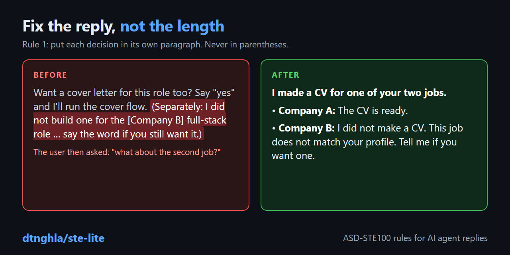

# ste-lite

ste-lite is an agent skill. It makes the replies of an AI agent clearer. It uses 12 groups of rules from ASD-STE100 Simplified Technical English (STE), Issue 9.



## What the audit found

The rules come from an audit of 10 real agent sessions.

Long sentences were not the problem. The average sentence had 11.4 words.

These problems were more frequent:

- A decision was in parentheses at the end of a reply.
- A step for the user was in a note.
- A pronoun could refer to two items.
- One sentence had two statements, joined with a dash.
- The text had idioms.
- The text had abbreviations with no expansion.

In one session, a decision about the second job was in parentheses at the end of the reply. The user then asked "what about the second job?".

## Install

Run this command to install the skill in the current project:

```bash
npx skills add dtnghla/ste-lite
```

Add `-g` to install the skill for all projects:

```bash
npx skills add dtnghla/ste-lite -g
```

You can also copy the repository to a skills folder:

- Cursor: `~/.cursor/skills/ste-lite`
- Claude Code: `~/.claude/skills/ste-lite`

The skill file is `SKILL.md`. The agent loads it when it writes text for you.

## The 12 rules

1. Start with the answer, and give each topic its own paragraph.
2. Write each action for the user as a step, not as a note.
3. Make each pronoun and reference point to one item that the reader saw.
4. Write one topic in each sentence.
5. Use one term for one item.
6. Write complete sentences.
7. Use words with their literal meaning.
8. Use words that the reader knows.
9. Say who does each action.
10. Use a vertical list for complex text.
11. Keep sentences and paragraphs short.
12. Put the warning before the risky step.

`SKILL.md` has the full text of each rule, with examples from the audit.

## Example

This is rule 1. The reply was to a request with two job descriptions.

**Before:**

> Want a cover letter for this role too? Say "yes" and I'll run the interactive cover flow. (Separately: I did not build one for the [Company B] full-stack role. It's a TypeScript/Cloudflare fundraising-platform job well outside your archetypes. Say the word if you still want it.)

**After:**

> I made a CV for one of your two jobs.
>
> - **[Company A], AI Research Engineer:** The CV is in `output/cv-company-a.pdf`.
> - **[Company B], Full-Stack Engineer:** I did not make a CV. This job is for a TypeScript and Cloudflare fundraising platform. It does not match the job types in your profile. Tell me if you want a CV for this job.
>
> Do you also want a cover letter for the [Company A] job?

## The checker

The file `scripts/ste-check.mjs` is an advisory checker. It finds many violations of rules 4, 6, 7, 8, 9, and 11. It needs Node.js and has no other dependencies.

Run it on a file:

```bash
node scripts/ste-check.mjs draft.md
```

These options are available:

- `--strict` makes the exit code 1 if a result is not marked "(review)".
- `--quotes` makes the checker read blockquotes also.

The checker skips code blocks, blockquotes, and headings. Some results are heuristic. The checker marks these results with "(review)", and they can be false.

## Limits of the audit

Do not read the audit as a benchmark. It is a small sample.

- The audit has 10 sessions.
- 8 of the 10 sessions used one model (muse-spark-1.3) in one tool (OpenCode).
- 7 of the 10 sessions used one job-search tool (career-ops).
- Only 1 session used a Claude model.
- The audit did not test if the rules give better results for other users.

The method and the evidence are in [references/audit.md](references/audit.md).

## License

This project uses the Massachusetts Institute of Technology (MIT) license. See [LICENSE](LICENSE).

## Trademark

ASD-STE100 Simplified Technical English is an EU registered trademark owned by the Aerospace, Security and Defence Industries Association of Europe (ASD). This project is not affiliated with ASD.
